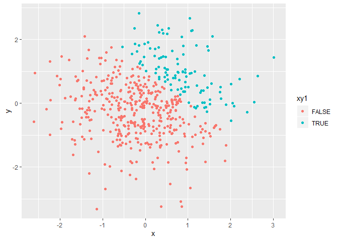
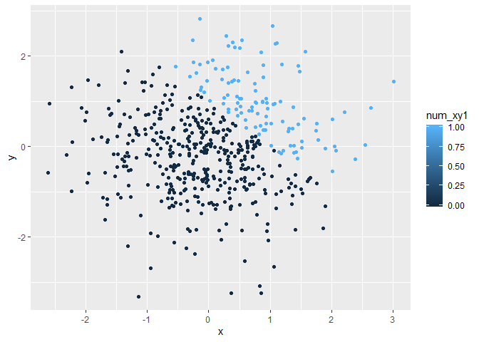
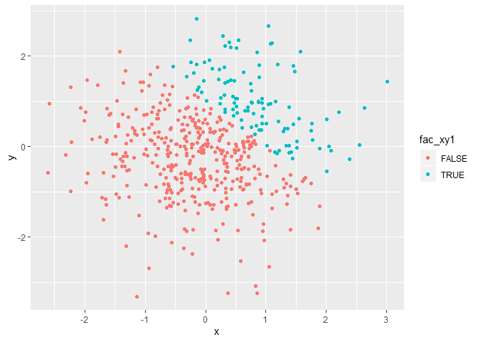

Homework 1
================
Sarah McLarnan
2019-09-13

PROBLEM 1
---------

``` r
library(tidyverse)

df_q1 = tibble(
  num_vec = rnorm(8),
  num_vec_pos = num_vec > 0,
  char_vec = c("one", "two", "three", "four", "five", "six", "seven", "eight"),
  fac_vec = factor(c("1", "2", "3", "1", "2", "3", "1", "2"))
)

mean(pull(df_q1, num_vec))
```

    ## [1] -0.2077746

``` r
mean(pull(df_q1, num_vec_pos))
```

    ## [1] 0.5

``` r
mean(pull(df_q1, char_vec))
```

    ## Warning in mean.default(pull(df_q1, char_vec)): argument is not numeric or
    ## logical: returning NA

    ## [1] NA

``` r
mean(pull(df_q1, fac_vec))
```

    ## Warning in mean.default(pull(df_q1, fac_vec)): argument is not numeric or
    ## logical: returning NA

    ## [1] NA

Created dataframe for question 1 with four vector. Attempted to calculate mean of each vectorr. Successfully calculated the means of both the numeric and logical vectors. Recieved errors for the character and factor vectors because they are not numeric or logical.

``` r
as.numeric(pull(df_q1,num_vec_pos))
as.numeric(pull(df_q1, char_vec))
as.numeric(pull(df_q1, fac_vec))
```

The as.numeric converted each vector to numeric. In the case of the logical vector it assigned 0 to FALSE and 1 to TRUE. THe function was unable to assign a number to the character vector and NA was entered. The factor vector was converted to 1, 2, and 3 in accordance with the factor levels. The coding of the logical vector as 0s and 1s helps explain why it is possible to take the mean of a logical vector but not the character and factor vectors.

``` r
as.numeric((pull(df_q1, num_vec_pos))*(pull(df_q1, num_vec)))
```

    ## [1] 1.3475400 0.0000000 0.2502929 0.0000000 0.0000000 0.0000000 1.0750203
    ## [8] 0.8932881

``` r
as.factor((pull(df_q1, num_vec_pos))*(pull(df_q1, num_vec)))
```

    ## [1] 1.34754003725477  0                 0.250292934535207 0                
    ## [5] 0                 0                 1.075020305603    0.893288083144966
    ## 5 Levels: 0 0.250292934535207 0.893288083144966 ... 1.34754003725477

``` r
as.numeric((as.factor((pull(df_q1, num_vec_pos))*(pull(df_q1, num_vec)))))
```

    ## [1] 5 1 2 1 1 1 4 3

PROBLEM 2
---------

``` r
df_q2 = tibble(
  x = rnorm(500),
  y = rnorm(500),
  xy1 = x + y > 1,
  num_xy1 = as.numeric(xy1),
  fac_xy1 = as.factor(xy1)
)
```

The dataset is 500 rows by 5 columns. The mean of variable x is 0.0011346, the median is -0.0246524, and the standard deviation is 0.9268838. The proportion of cases in which x + y &gt; 1 is 21.8.

``` r
plot_x_y = ggplot(df_q2, aes(x=x, y=y, color=xy1)) + geom_point()
  plot_x_y
```



``` r
plot_num_xy1_x = ggplot(df_q2, aes(x=x, y=y, color=num_xy1)) + geom_point()
  plot_num_xy1_x
```



``` r
plot_fac_xy1_x = ggplot(df_q2, aes(x=x, y=y, color=fac_xy1)) + geom_point()
  plot_fac_xy1_x
```



``` r
ggsave("homework_1_plot.png", plot=plot_x_y)
```

plot\_x\_y is a scatter plot of the logical vector that describes whether x + y &gt; 1 with red points being false (&lt;=1) and blue being true (&gt;1), the scale is dichotomous because it is a logical vector. Plot\_num\_xy1\_x is a scatter plot of the numeric vector created from the logical vector that describes whether x + y &gt; 1. In this case the blue points indicate 1s (x + y &gt;1) and black points are 0s (x + y &lt;= 1), however because the vector is numerica the scale is now continuous as seen by the gradient in the legend. Plot\_fac\_xy1\_x is a scatter plot of the factor vector created from the logical vector describing whether x + y &gt; 1. As with the first graph red points are false (&lt;=1) and blue are true (&gt;1), the scale is dichotomous because it is a factor vector with two levels.
